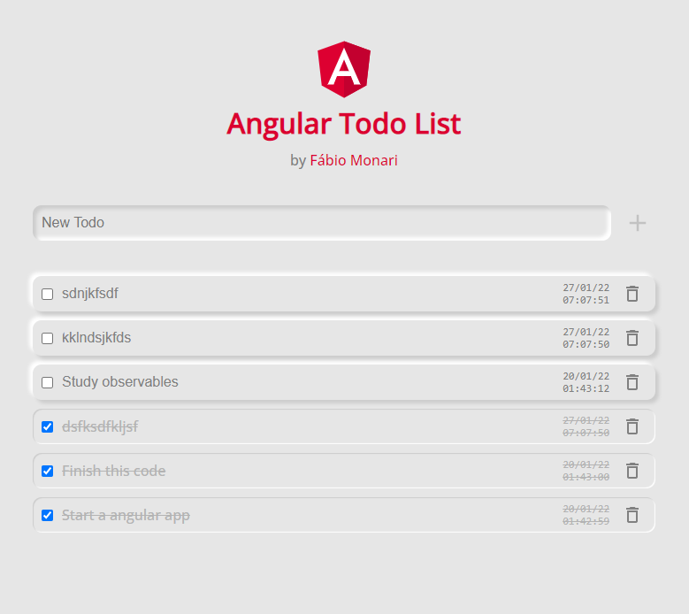

# Angular Todo List App

by [Fábio Monari](https://github.com/fabiomonari)

Simple Angular todo list app, for learning purposes.

### Made with:

- [Angular 13.1.1](https://angular.io/)
- [Moment.js](https://www.npmjs.com/package/moment)
- [NGX Cookie Service](https://www.npmjs.com/package/ngx-cookie-service)
- Neumorphism Style

### Requirements

- [x] A list with active todo’s;
- [x] A list with completed todo’s;
- [x] Users can edit a todo;
- [x] Users can delete a todo;
- [x] Users can see the date and time of created todo;
- [x] Simples data storage: When closing the browser window the todo’s will be stored and when the user returns, the data will be retrieved.
